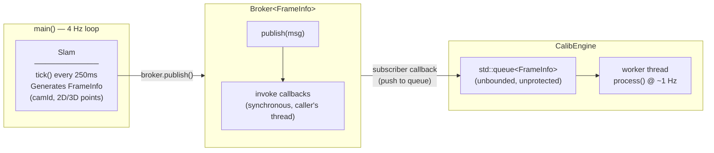

# pubsub

A C++ publish-subscribe messaging framework built as a workbench for incrementally exploring and benchmarking inter-component communication patterns in real-time perception pipelines.

The initial implementation is intentionally simple — a synchronous, single-threaded broker connecting a SLAM publisher to a CalibEngine consumer. From this baseline, the goal is to introduce and benchmark progressively advanced patterns: thread-safe queues, ring buffers, lock-free SPSC queues, multiple consumers, and more.

---

## Architecture

### Current Design



### Data Flow (Step by Step)

```
main()
  └─► slam.tick()                         [every 250ms, 4 Hz]
        └─► broker.publish(frame)
              └─► [for each subscriber cb]
                    └─► CalibEngine::lambda  (runs on SLAM's thread)
                          └─► queue_.push(frame)
                                └─► [worker thread]
                                      └─► process()   [drains queue @ ~1 Hz]
```

---

## Components

### `FrameInfo` — Message Type

```cpp
struct FrameInfo {
    int              camId_;      // Camera identifier (0–99 in simulation)
    Eigen::MatrixX2f points2D_;   // Nx2 matrix of 2D image keypoints
    Eigen::MatrixX3f points3D_;   // Nx3 matrix of 3D world points
};
```

The primary message contract between publisher and consumers. Uses Eigen dynamic matrices, making it representative of real perception pipeline payloads.

---

### `Broker<T>` — Message Bus

```cpp
template <typename T>
class Broker {
public:
    void publish(const T& msg);       // Notify all subscribers synchronously
    void subscribe(Callback cb);      // Register a callback
private:
    std::vector<Callback> subscribers_;
};
```

A templated, synchronous broker. On `publish()`, it iterates all registered callbacks and invokes them inline on the **caller's thread**. No queuing, no threading, no backpressure — intentionally minimal as a starting point.

---

### `Slam` — Publisher

```cpp
class Slam {
public:
    void tick();   // Generate and publish one FrameInfo
};
```

Simulates a SLAM front-end running at 4 Hz. On each `tick()`, it creates a `FrameInfo` with a random camera ID and 5 randomly-valued 2D/3D point pairs (via Eigen's `setRandom()`), then publishes to the broker.

---

### `CalibEngine` — Subscriber / Consumer

```cpp
class CalibEngine {
public:
    CalibEngine(Broker<FrameInfo>& broker);   // Subscribes on construction
    void process();                            // Worker thread: drains queue
private:
    std::queue<FrameInfo> queue_;
    std::thread           worker_;
};
```

Subscribes to the broker at construction time. The subscription callback pushes incoming frames into a `std::queue`. A background worker thread runs `process()`, consuming frames and simulating a slow operation (1 Hz via `sleep_for(1000ms)`).

---

## Known Limitations (v0 — Baseline)

These are deliberate starting-point constraints, not oversights. Each will be addressed in a planned iteration:

| # | Limitation | Impact |
|---|------------|--------|
| 1 | **Data race on `queue_`** | The subscriber callback (running on SLAM's thread) and `process()` (worker thread) access `std::queue` concurrently with no mutex. Undefined behaviour. |
| 2 | **`process()` is not a persistent loop** | The worker thread drains the queue once at startup, then exits. Frames published after the thread drains will never be processed. |
| 3 | **Synchronous callback dispatch** | `broker.publish()` blocks until all subscriber callbacks return. A slow subscriber stalls the publisher. |
| 4 | **Unbounded `std::queue`** | Under sustained load, the queue grows without limit. No backpressure, no eviction policy. |
| 5 | **Single consumer only** | No mechanism for multiple independent consumers with isolated state. |
| 6 | **No benchmarking instrumentation** | The commented-out `duration_cast` in `Slam::tick()` is the only timing hook. No systematic latency or throughput measurement. |

---

## Roadmap

Each iteration introduces one or more targeted improvements, with benchmarks comparing it against the previous baseline.

### ✅ Iteration 1 — Fix the Baseline
- Add a `std::mutex` + `std::condition_variable` to `CalibEngine`
- Turn `process()` into a persistent `while(running_)` loop that blocks on `cv.wait()`
- Guarantee correct teardown (join worker thread in destructor)
- Measure: publisher `tick()` latency with/without slow subscribers

### ✅ Iteration 2 — Ring Buffer
- Replace `std::queue` with a fixed-capacity circular buffer
- Implement overwrite-on-full vs. drop-on-full policies
- Measure: memory footprint, cache behaviour, throughput under saturation

### Iteration 3 — Lock-Free SPSC Queue
- Implement a single-producer single-consumer (SPSC) lock-free queue using `std::atomic`
- Appropriate for the current 1-publisher → 1-consumer topology
- Measure: latency and throughput vs. mutex-protected queue at varying publish rates

### Iteration 4 — Multiple Consumers
- Extend `Broker` to support per-subscriber independent queues (fan-out)
- Each consumer gets its own SPSC ring buffer
- Add a second consumer (e.g., `DepthEngine`) alongside `CalibEngine`
- Measure: per-consumer lag under different processing speeds

### Iteration 5 — MPSC / Full Concurrency
- Explore multi-producer scenarios (multiple SLAM instances)
- Evaluate `moodycamel::ConcurrentQueue` or a custom MPSC ring buffer
- Measure: scalability across producer/consumer thread counts

### Benchmarking Harness (parallel track)
- Integrate [Google Benchmark](https://github.com/google/benchmark)
- Track: end-to-end message latency (publish → process), queue throughput (msgs/sec), memory overhead per message, jitter under sustained load

---

## Build

### Dependencies

- C++17 or later
- [Eigen 3](https://eigen.tuxfamily.org/) (header-only; place under `eigen/` or install system-wide)

### Compile

```bash
g++ -std=c++17 -O2 -I. main.cpp -o pubsub
```

If Eigen is installed system-wide (`/usr/include/eigen3`):

```bash
g++ -std=c++17 -O2 -I/usr/include/eigen3 main.cpp -o pubsub
```

### Run

```bash
./pubsub
```

Expected output (truncated):

```
Pushing to queue
[SLAM] Published data: Cam ID 83
Popped from queue. Data: Cam ID 83
Pushing to queue
[SLAM] Published data: Cam ID 15
...
```

---

## File Structure

```
pubsub/
├── main.cpp          # Entry point: wires broker, SLAM, CalibEngine; runs 4 Hz loop
├── Broker.h          # Templated synchronous pub/sub broker
├── FrameInfo.h       # Message struct (camId, 2D/3D Eigen point matrices)
├── Slam.h            # Publisher: generates and publishes FrameInfo at 4 Hz
├── CalibEngine.h     # Subscriber: queues frames, processes at ~1 Hz on worker thread
└── eigen/            # Eigen header-only library (local copy)
```

---

## Context

The publisher/subscriber pattern is fundamental in real-time perception systems — separating sensor-facing producers (SLAM, depth estimation, IMU integration) from downstream consumers (calibration, mapping, rendering) via a decoupled message bus. This repo uses a minimal SLAM-to-CalibEngine pipeline as a concrete, instrumentable testbed for exploring how different queue and threading strategies affect latency, throughput, and safety in that kind of system.
